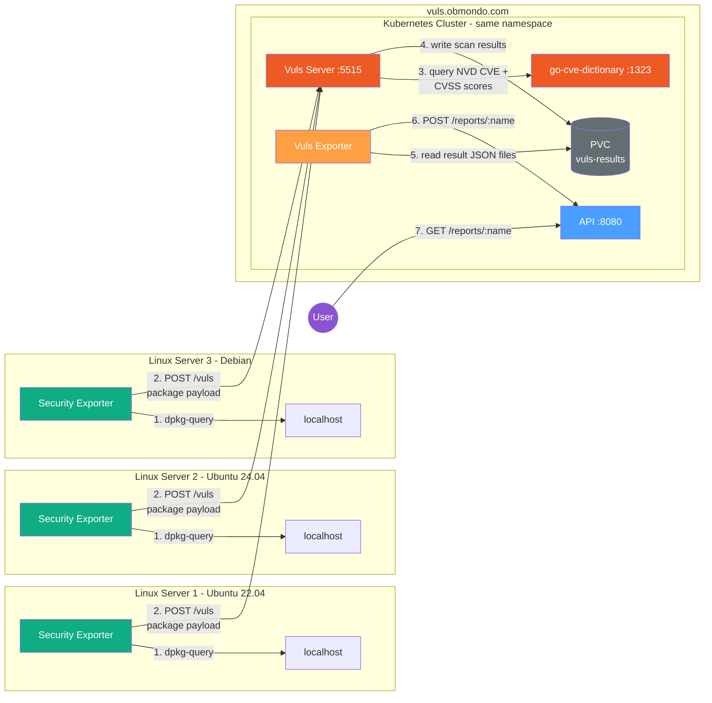

# Vuls Security Scanner - Architecture

## Overview

A vulnerability scanning pipeline that collects installed packages from remote Linux servers,
scans them against the NVD CVE database, and serves reports via a REST API.

The **Security Exporter** is installed on each Linux server as a lightweight Go binary.
It runs `dpkg-query` locally to collect the installed package list and sends it to the
Vuls Server hosted at `vuls.obmondo.com`.

The **Vuls Stack** runs inside a Kubernetes cluster. Vuls Server receives package payloads,
matches them against NVD CVE data (via go-cve-dictionary), and writes scan results with
CVSS scores to a shared PVC.

The **Vuls Exporter** is a simple Go daemon deployed in the same namespace as Vuls Server
so it can mount the same PVC. It watches for new result files and pushes them to the API.

The **API** stores and serves vulnerability reports. Users can list all reports or view
a specific server's CVE report with CVSS scores.

## Architecture Diagram

## Flow

1. **Security Exporter** runs `dpkg-query` on the local server to collect installed packages and versions
2. **Security Exporter** sends the package list as a JSON payload to Vuls Server via `POST /vuls`
3. **Vuls Server** queries **go-cve-dictionary** to match packages against NVD CVEs with CVSS2/CVSS3 scores
4. **Vuls Server** writes the scan result as a JSON file to the shared PVC (`-to-localfile`)
5. **Vuls Exporter** polls the PVC for new result files
6. **Vuls Exporter** pushes each result to the **API** via `POST /reports/:name`
7. **User** queries the API to view reports — `GET /reports` to list, `GET /reports/:name` for details

## Components

| Component | Type | Description |
|---|---|---|
| Security Exporter | Go binary on each server | Collects packages, sends to Vuls Server |
| Vuls Server | k8s Deployment | Scans packages against CVE DB |
| go-cve-dictionary | k8s Deployment | Serves NVD CVE data with CVSS scores |
| Vuls Exporter | k8s Deployment (same ns) | Watches result files, pushes to API |
| API | k8s Deployment | Stores and serves vulnerability reports |
| PVC | PersistentVolumeClaim | Shared storage for scan result files |
